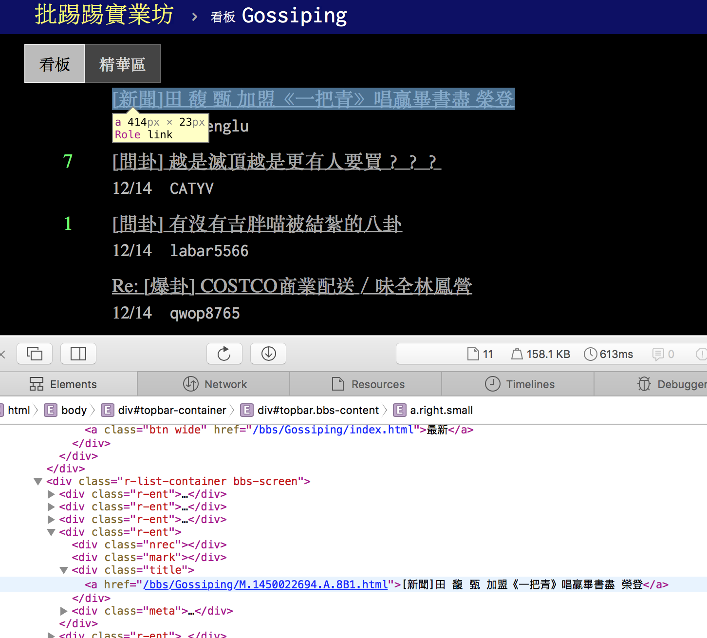

```{r setup, include=FALSE}
knitr::opts_chunk$set(cache=TRUE)
options(width=120)
library(data.table)
library(magrittr)
library(parallel)
library(ggplot2)
library(stringr)
library(rvest)
library(httr)
```

------------------------------------
## Facebook Graph API | Introduction
### > the UI for exploration
+ [Facebook Graph API Explorer](https://developers.facebook.com/tools/explorer)
    + need a valid *access token*
    + the token will expire in hour (and can be refreshed)

### > components of the API
+ nodes
    + **objects**: a User, a Photo, a Page, a Comment, ...
+ edegs
    + **connections** between objects
+ fields
    + **information** about objects

### > baisc syntax
`/<node_id>/<edge_name>?fields=f1,f2,...`

+ try the special `me` node: `me/photos?fields=from`
+ the `me` node resolves to id of the user that owns the current token

### > which field?
+ not all fields are returned by default
+ use query string `metadata=1` to show available fields/edges on a node
    + `<node_id>?metadata=1`
    + e.g.: `me?metadata=1`

### > nested query
+ solution 1:
    + `<node_id>?fields=f1{subf1,subf2,...},f2,...`
    + e.g.: `me?fields=photos{from,id}`
+ solution 2: (recommended)
    + `<node_id>?fields=f1.fields(subf1,subf2,...),f2,...`
    + e.g.: `me?fields=photos.fields(from,id)`
+ no limit on the depth of nesting

### > node? edge?

+ edge is the *population*, node is the *individual*
    + "all of my photos" => edge (no id)
    + "this photo of mine" => node (with id)
+ fields are defined on nodes
+ difference in syntax (and returned json):
    + field querying: `me?fields=photos{from}`
    + edge querying: `me/photos?fields=from`

### > query modifiers
#### >> limit
to restrict the number of records returned

+ on field:
    + `me?fields=photos.limit(10)`
+ on edge:
    + `me/photos?limit=10`

#### >> summary
to return a count for totals regardless of the actuall number of records returned

+ on field:
    + `<photo_id>?fields=likes.summary(true)`
+ on edge:
    + `<photo_id>/likes?summary=true`

#### >> since
to restrict the valid starting timeframe of the data returned

+ on field:
    + won't work
+ on edge:
    + `me/posts?since=1420070400`

+ [unix time converter](http://www.epochconverter.com)
+ what is unix time?
    + total seconds elapsed since 1970-01-01 UTC time
    + 1420070400 is 2015-01-01 UTC

### > modifier chaining
multiple modifiers can be chained together

+ on field:
    + `<photo_id>?files=likes.limit(1).summary(true)`
+ on edge:
    + `<photo_id>/likes?limit=1&summary=true`

### > Exercise: Who likes me?

1. start from `me`
2. is `posts` an edge or a field of `me`?
    + either of the following query works:
    + `me/posts`
    + `me?fields=posts`
3. pickup an arbitrary post
    + how many fields does it have?
    + use `metadata=1` query string to investigate!
4. is `likes` an edge or a field of `posts`?
5. use the `since` modifier to specify a starting time
6. use the `summary` modifier to get a total counts

TL;NR?
`me/posts?fields=likes.fields(name).summary(true)&since=1420070400&limit=100`

### > GET, POST, and DELETE
+ use `GET` method to query the graph API
+ use `POST` method to create/update data onto the grath API
+ use `DELETE` method to delete data from the graph API


+ some POST use cases:
    + post an article onto your wall
        + add `message` field on `me/feed`
    + like a post
        + add `likes` edge on a post node

## Facebook Graph API | Crawling

### > behind the scence
+ **API call = HTTP request**
+ any programming language that can handle HTTP request is capable of crawling it
+ the bottom-right of the Graph API Explorer:

```
curl -i -X GET \
 "https://graph.facebook.com/v2.4/me?fields=context&access_token=CAACEdEose0cBAL34H6NiMZB3ZCnPaZBnShQoSY9GZCh81kDLbQZArxKGEPY981H7KfBUjG99jThga2OxQ7owu03IZCgoEcjMDmVSyeZAzos3JZBvWEzbRbfX0DZAl0Au2ybbbZCNZBOsZCYGmjKqCLyTHftwrnOerU07Pismb3QBxYommKEo7oGsWTIIREpbKu4VlHMJY7Q7ZBY00aAZDZD"
```

### > Exercise: Get all metadata fields of the `me` node
1. use a library that handles HTTP requests

```{r load httr}
if ( ! "httr" %in% rownames(installed.packages()) )
    install.packages("httr")
library("httr")
```

2. observe the actuall request made from the Graph API
    + take a look at the `cURL` section from the "get code" button

3. ensemble the request string

```{r ensemble request}
# the target API url
api_addr <- "https://graph.facebook.com/v2.4/me"

# a valid token
token <- "CAACEdEose0cBANP9cpWekr6LdPyHLwPdzHZCfcYAfGX0FCGN8W2AIaWJPxbH5BGOmgycPRPcvgg8gtaEbySG3NwOBADud9kVSZCdw7Px7b84gO7SZCqfMusf3Y6vtuy6hySl2BNPD0tfi6mtu6MpvJvZCfz6Wyc51jfK8X9mNMW661mhYWLlAV6E6wvzdd6hfHOSZCGU3fAZDZD"

# build the query string for the GET method
qs <- list(metadata=1, access_token=token)
```

4. make the query

```{r call the get method}
r <- GET(api_addr, query=qs)
```

5. check the response

```{r check response}
print(r)
str(r, max.level=1)
```

6. parse the resulting json data

```{r parse json}
# parse json
parsed_contents <- content(r) # see ?content for more details
str(parsed_contents, max.level=2)

# extract all fields
parsed_contents$metadata$fields %>%
    sapply(function(x) x[["name"]]) %>% 
    writeLines

# extract all edges (connections)
parsed_contents$metadata$connections %>% 
    names %>%
    writeLines
```

### > Exercise: Get all paginated data
> Scenario: find a post, get a list of names from all users liked it

1. **OBSERVE! OBSERVE! OBSERVE!**
    + pickup a post of yours
    + query the `likes` data on it
        + `<post_id>/likes` or `<post_id>?fields=likes`
    + then what? observe...
        + post without any like
        + post with little likes not paginated
        + post with lots of likes that get paginated
        + the final page for the above kind
    + HINT: use the following query to quickly scan posts with various number of likes
        + `me/posts?fields=likes.limit(1).summary(true)`

=> post without any like


=> post with little likes not paginated


=> post with lots of likes that get paginated


=> the final page for the above kind


2. write a function to deal with the above data

```{r traverse pagination}
getAllLikes1 <- function(token, node) {
    require(httr)
    result <- list()
    api_addr <- sprintf("https://graph.facebook.com/v2.4/%s/likes", node)
    qs <- list(fields="name", access_token=token)
    r <- GET(api_addr, query=qs)
    res <- content(r)
    if ( !length(res$data) ) {
        result
    } else {
        result <- c(result, res$data)
        while ( "next" %in% names(res$paging) ) {
            cursor_next <- res$paging$cursors$after
            qs$after <- cursor_next
            r <- GET(api_addr, query=qs)
            res <- content(r)
            result <- c(result, res$data)
        }
        result
    }
}

getAllLikes2 <- function(token, node) {
    result <- list()
    api_addr <- sprintf("https://graph.facebook.com/v2.4/%s/likes", node)
    qs <- list(fields="name", access_token=token)
    r <- GET(api_addr, query=qs)
    res <- content(r)
    if ( !length(res$data) ) {
        result
    } else {
        result <- c(result, res$data)
        while ( "next" %in% names(res$paging) ) {
            next_query <- res$paging$`next`
            r <- GET(next_query)
            res <- content(r)
            result <- c(result, res$data)
        }
        result
    }
}
```

3. check results

```{r, check result}
node <- "100000862115668_932029203502475"
result1 <- getAllLikes1(token=token, node=node)
result2 <- getAllLikes2(token=token, node=node)
all.equal(result1, result2) # should return T

# tidy into data.frame
head(do.call(rbind, result1))
```

### > Exercise: Plot trending of likes on `me/posts`

1. what do we need?
    + a starting time
    + all post since the starting time with
        + post creating time
        + post likers (preferrably name, id)

2. **OBSERVE!**
    + `me/posts?fields=created_time,likes.fields(id,name)&since=1420070400`
    + don't forget about the pagination issue
        + posts may be paginated
        + likes per post may be paginated

3. blueprint your program
    + some suggerstions:
        + don't write a huge function to solve the entire problem
        + try dividing the problem into sub-problems
        + for each sub-problem, write small function to solve it

```{r, blueprint}
# think about a blueprint of your craqwler
        
# need a helper to convert datetime string to timestamp
str2Timestamp <- function(dts) {}

# need a function to crawl all post id in a given time
getPostId <- function(dts, token) {}

# need a function to crawl all like info given a post id
getLikes <- function(pid, token) {}
```

4. implement

```{r implementation: unix time convert}
# unix time conversion
str2Timestamp <- function(dts)
    as.integer(as.POSIXct(dts, origin="1970-01-01"))

# try it
str2Timestamp("2015-01-01")
```
    
```{r implementation: get post id}
# get post id given a start time
getPostId <- function(dts, token) {
    require(data.table)
    require(magrittr)
    require(httr)
    result <- list()
    api_addr <- "https://graph.facebook.com/v2.4/me/posts"
    qs <- list(since=str2Timestamp(dts), access_token=token)
    r <- GET(api_addr, query=qs)
    res <- content(r)
    if ( !length(res$data) ) {
        result
    } else {
        result <- c(result, res$data)
        while ( "next" %in% names(res$paging) ) {
            next_query <- res$paging$`next`
            r <- GET(next_query)
            res <- content(r)
            result <- c(result, res$data)
        }
        result %<>% 
            lapply(function(x) c(time=x$created_time, pid=x$id)) %>% 
            do.call(rbind, .) %>%
            as.data.table %>%
            .[, time:=as.POSIXct(time, format="%Y-%m-%dT%H:%M:%S%z")]
        result
    }
}

# try it
getPostId("2015-01-01", token=token) %>% head

# caution!
# one post may have multiple timestamps due to attached photo editing
```

```{r implementation: get likes}
# get likes given a post id
getLikes <- function(pid, token) {
    require(data.table)
    require(magrittr)
    require(httr)
    result <- list()
    fields <- c("id", "name")
    api_addr <- sprintf("https://graph.facebook.com/v2.4/%s/likes?fields=%s", 
                        pid, paste(fields, collapse=','))
    qs <- list(access_token=token)
    r <- GET(api_addr, query=qs)
    res <- content(r)
    if ( !length(res$data) ) {
        result
    } else {
        result <- c(result, res$data)
        while ( "next" %in% names(res$paging) ) {
            next_query <- res$paging$`next`
            r <- GET(next_query)
            res <- content(r)
            result <- c(result, res$data)
        }
        result %>% rbindlist %>% cbind(pid=pid)
    }
}

# try it
getLikes(pid=getPostId("2015-01-01", token=token)$pid[1], token=token) %>% head
```

5. check results

```{r run}
all_posts <- getPostId("2014-01-01", token=token) %>%
    .[, list(time=max(time)), by="pid"]

all_likes <- lapply(all_posts$pid, getLikes, token=token) %>%
    do.call(rbind, .) %>%
    merge(all_posts, by="pid")

head(all_likes)
```

6. [(not-so) advanced] speed up by parallelizing

```{r run parallel}
library(parallel)

system.time(
    all_likes1 <- lapply(all_posts$pid, getLikes, token=token)
    )

# for Windows guys: parallel by Rscripting
cl <- makeCluster(detectCores())
system.time(
    all_likes2 <- parLapply(cl, all_posts$pid, getLikes, token=token)
    )
stopCluster(cl)

# parallel by forking: *nix only
# system.time(
#     all_likes3 <- mclapply(all_posts$pid, getLikes, token=token, 
#                            mc.cores=detectCores())
#     )

all.equal(all_likes1, all_likes2)
```

7. plot

```{r plot: tidy}
library(ggplot2)

setorder(all_likes, time)
all_likes <- all_likes[, timed:=as.Date(time)]
all_likes <- all_likes[, timed:=as.Date(time)]
like_trending1 <- all_likes[, list(n_like=.N), by="timed"]
like_trending2 <- all_likes[, list(n_like=.N), by="name,timed"]
top_likes <- all_likes[, list(n_like=.N), by="name"] %>% setorder(-n_like)
```

```{r plot: ggplot2, fig.width=10, warning=FALSE}
like_trending1 %>% 
    ggplot(aes(x=timed, y=n_like)) + geom_line() + geom_point()

like_trending2[name %in% top_likes$name[1:5]] %>%
    ggplot(aes(x=timed, y=n_like, color=name)) + geom_line() + geom_point() +
    theme(text=element_text(family='Heiti TC Light')) # required to show chinese on OSX
```

### > Exercise: The warrior of likes

1. OBSERVE your friends
    + `me/friends`
    + obviously, not all your friends are listed


2. any chance to get the user id of an arbitrary person?
    + use your browser: *inspect element*
    + search for keywords like `data-uid` or `uid`


3. OBSERVE the `posts` edge of your friends
    + `<uid>/posts`
    + obviously, not all posts are available *even if it is shared within friends*
    + this is due to the token permission checked
        + BOTH your tokens must grant related permission

4. whatever, let's crawl your friend list

```{r friend list}
getFriends <- function(token) {
    require(data.table)
    require(magrittr)
    require(httr)
    result <- list()
    api_addr <- "https://graph.facebook.com/v2.4/me/friends"
    qs <- list(access_token=token)
    r <- GET(api_addr, query=qs)
    res <- content(r)
    if ( !length(res$data) ) {
        result
    } else {
        result <- c(result, res$data)
        while ( "next" %in% names(res$paging) ) {
            next_query <- res$paging$`next`
            r <- GET(next_query)
            res <- content(r)
            result <- c(result, res$data)
        }
        result %>% rbindlist
    }
}

getFriends(token=token) %>% head
```

5. crawl all post id given a friend's id

```{r friend post}
getFriendPostId <- function(uid, dts, token) {
    require(data.table)
    require(magrittr)
    require(httr)
    result <- list()
    api_addr <- sprintf("https://graph.facebook.com/v2.4/%s/posts", uid)
    qs <- list(since=str2Timestamp(dts), access_token=token)
    r <- GET(api_addr, query=qs)
    res <- content(r)
    if ( !length(res$data) ) {
        result
    } else {
        result <- c(result, res$data)
        while ( "next" %in% names(res$paging) ) {
            next_query <- res$paging$`next`
            r <- GET(next_query)
            res <- content(r)
            result <- c(result, res$data)
        }
        result %<>% 
            lapply(function(x) c(time=x$created_time, pid=x$id)) %>% 
            do.call(rbind, .) %>%
            as.data.table %>%
            .[, time:=as.POSIXct(time, format="%Y-%m-%dT%H:%M:%S%z")]
        result
    }
}

getFriendPostId("100000862115668", "2015-01-01", token=token) %>% head
```

6. crawl posts of all your friends listed on Graph API

```{r crawl all friends all posts}
all_friends <- getFriends(token=token)

# since it may take some time, let's do it parallel
cl <- makeCluster(detectCores())
clusterExport(cl, "str2Timestamp")
all_friends_posts <- parLapplyLB(cl, all_friends$id, getFriendPostId, 
                                 dts="2015-01-01", token=token)
stopCluster(cl)

names(all_friends_posts) <- all_friends$name

post_counts <- sapply(all_friends_posts, 
                      function(x) if (!length(x)) 0 else nrow(x))
paste("number of posts available:", names(post_counts), post_counts, sep=" | ") %>% 
    head %>%
    write.table(quote=FALSE, row.names=FALSE, col.names=FALSE)
```

7. LIKE them all! (run with caution...)

```{r like them all}
postLike <- function(pid, token) {
    api_addr <- sprintf("https://graph.facebook.com/v2.4/%s/likes", pid)
    qs <- list(access_token=token)
    r <- POST(api_addr, query=qs)
    r
}

# try it
postArticle <- function(mesg, token) {
    api_addr <- sprintf("https://graph.facebook.com/v2.4/me/feed/")
    r <- POST(api_addr, body=list(access_token=token, message=mesg))
    content(r)
}

# notice that the resulting pid is a compound id in <uid_pid> format
(test_pid <- postArticle("test", token=token))
postLike(pid=test_pid, token=token)

# delete the test post
deletePost <- function(pid, token) {
    api_addr <- sprintf("https://graph.facebook.com/v2.4/%s", pid)
    qs <- list(access_token=token)
    r <- DELETE(api_addr, query=qs)
    r
}

deletePost(test_pid, token=token)

# # loop for all posts given a user
# me_id <- "100000862115668"
# all_my_posts <- getFriendPostId(me_id, "2015-01-01", token=token)
# lapply(all_my_posts$pid, postLike, token=token)
```

## Regular Expression Basics

### > what is it?
> ...a sequence of characters that define a search pattern, mainly for use in pattern matching with strings, or string matching, i.e. "find and replace"-like operations.
<br><br>-wikipedia

### > why we need it?
+ sometimes only CSS selector/XPath is not enough
    + contents may not be *structurally* distingushable
    + but can be distinguished by *string pattern*

> 有沒有⋯⋯的八卦？



+ in the above example, all "title"s are treated *equally* in html structure
    + what if you'd like to only crawl *specific* titles?
    + here comes the Regular Expression!

### > a quick journey

```{r re quick intro}
if ( ! "rvest" %in% rownames(installed.packages()) )
    install.packages("rvest")
library("rvest")

# crawl PTT Gossiping article titles
gossip <- GET("https://www.ptt.cc/bbs/Gossiping/index.html",
              set_cookies(over18=1))$content %>% read_html
(gossip_titles <- gossip %>% 
    html_nodes("div .title") %>% 
    html_text())
```

#### >> pattern replacing
+ remove unwanted characters
```{r re quick intro: replace}
(gossip_titles_cleansed <- gsub("\n\t*", '', gossip_titles))
```

#### >> pattern filtering
+ search for titles with "[問卦]" only
```{r re quick intro: filter 1}
# something wrong?
grep("[問卦]", gossip_titles_cleansed, value=TRUE) 

# how about...
grep("\\[問卦\\]", gossip_titles_cleansed, value=TRUE)
```

+ don't want reply article!
```{r re quick intro: filter 2}
grep("^\\[問卦\\]", gossip_titles_cleansed, value=TRUE)
```

+ only reply article
```{r re quick intro: filter 3}
grep("^Re: ", gossip_titles_cleansed, value=TRUE)
```

+ titles with ending question mark
```{r re quick intro: filter 4}
grep("？$", gossip_titles_cleansed, value=TRUE)
```

+ titles with any English alphabet
```{r re quick intro: filter 5}
grep("[a-zA-Z]", gossip_titles_cleansed, value=TRUE)
```

### > basic components of RE
+ characters (string-literals)
    + `ABCabc123`
+ meta-characters (operators)
    + `. ^ $ * + ? { } [ ] \ | ( )`
+ special sequences (short-cuts)
    + `\d \D \s \S \w \W \b \B`

#### >> wildcarder: `.`
+ match anything 
    + *except* newline(`\n`) for *Perl* RE
    + yes there are different versions of RE
    + but the foundementals are essentially the same
    
```{r re basics: .}
test_str <- c("hello world", "你好啊", "\n") 
grep('.', test_str, value=TRUE, perl=TRUE)
grep('.', test_str, value=TRUE, perl=FALSE)
```

#### >> bounders: `^` and `$`
+ `^` limits the begining character
+ `$` limits the ending character

```{r re basics: ^$}
grep('^hello', test_str, value=TRUE)
grep('world$', test_str, value=TRUE)
grep('^[h你]', test_str, value=TRUE)
```

#### >> repeaters: `*`, `+`, and `?`
+ `*`: the previous unit must repeat **0 or many times**
+ `+`: the previous unit must repeat **1 or many times**
+ `?`: the previous unit must repeat **0 or 1 times**

```{r re basics: *+?}
grep("l*", test_str, value=TRUE)
grep("l+", test_str, value=TRUE)
grep("l?", test_str, value=TRUE)
```

#### >> advanced repeaters: `{m,n}`
+ the previous unit must repeat **at least m times and at most n times**

```{r re basics: {m,n}}
grep("l{0,10}", test_str, value=TRUE)
grep("l{2}", test_str, value=TRUE)
grep("l{,2}", test_str, value=TRUE)
grep("l{2,}", test_str, value=TRUE)
```

#### >> class: `[]`
+ a set of characters that *may* occcur
+ meta-char will lose their speacial meaning within it
    + `[0-9$]` matches any of numbers 0 to 9 or the dollar sign($)
    + here the bounder meta-char `$` is treated "as-is""
    + special meaning only triggered within the class:
+ class-specific metas:
    + `-`: ranger
        + e.g., `[0-9a-zA-Z]`
    + `^`: negator 
        + e.g., `[^0-9]`

```{r re basics: []}
grep("[a-z]", test_str, value=TRUE)
grep("[0-9]", test_str, value=TRUE)

# want to match the dash (-) ?
grep("[a-z-]", c("abc", "123-456"), value=TRUE)
```

#### >> grouper: `()`
+ to group multiple characters as one unit such that...
    + all other metas will operate on the entire grouped char
    + useful for pattern **match and extraction**

```{r re basics: ()}
test_str2 <- c("hello", "olleh", "hellohello")
test_str2 %>% grep("^hello$", ., value=TRUE)
test_str2 %>% grep("^[hello]$", ., value=TRUE)
test_str2 %>% grep("^(hello)?$", ., value=TRUE)
test_str2 %>% grep("^(hello)+$", ., value=TRUE)
```

#### >> or: `|`
+ to qualify one of multiple regex

```{r re basics: |}
grep("^h|^你", test_str, value=TRUE)
```

#### >> escaper: `\`
+ to make its following unit **as-is**
    + the special meaning, if any, is said to be escaped
    + escaper must be *doubled* in R
        + due to language implementation
        + may not be the case for using re in other languageg
        
```{r re basics: `\`}
grep("^\\^", "^123", value=TRUE)
```

#### >> other special sequences
+ short-cut of specific character classes
+ `\d`: any decimal digit => `[0-9]`
+ `\D`: any non-digit => `[^0-9]`
+ `\s`: any white space => `[ \t\n\r\f\v]`
+ `\S`: any non-white space => `[^ \t\n\r\f\v]`
+ `\w`: any alphanumeric => `[a-zA-Z0-9_]`
+ `\W`: any non-alphanumeric => `[^a-zA-Z0-9_]`
+ `\b`: matches the empty string, but only at the beginning or end of a word (`\w`)

## Regular Expression facilities in R

### > `base::grep` and `base::grepl`
+ `grep`: match and return
    + it is vectorized
    + can return either **numeric index** or **original charaters**
    + or return **logical vector** by using `grepl`

```{r grep}
# return numeric index
grep("^Re: ", gossip_titles_cleansed)

# then can used as selecting vector
gossip_titles_cleansed[grep("^Re: ", gossip_titles_cleansed)]

# which effectively equals...
grep("^Re: ", gossip_titles_cleansed, value=TRUE)

# the no-match case
grep("1p3fjhi1o", gossip_titles_cleansed)
grep("1p3fjhi1o", gossip_titles_cleansed, value=TRUE)

# the fixed patter: no re, all as-is
grep("^Re: ", gossip_titles_cleansed, value=TRUE, fixed=TRUE)

identical(grep("[新聞]", gossip_titles_cleansed, value=TRUE, fixed=TRUE),
          grep("\\[新聞\\]", gossip_titles_cleansed, value=TRUE, fixed=FALSE))
```

### > `base::gsub`
+ **find and replace all**
    + use `sub` to replace only once
+ also very useful for **find-and-delete all** scenario

```{r gsub}
gsub("\\].*", '', gossip_titles_cleansed)
gsub("^.*\\[", '', gossip_titles_cleansed)
gsub("\\].*|^.*\\[", '', gossip_titles_cleansed)
```

### > the `stringr` library
+ why use it?
    + more intuitive than the built-in RE facilities
    + developed by [Hadley Wickham](https://github.com/hadley/stringr)
        + who also writes `httr`, `ggplot2`, and many others

```{r load stringr}
if ( ! "stringr" %in% rownames(installed.packages()) )
    install.packages("stringr")
library("stringr")
```

#### >> usage: `str_extract` and `str_extract_all`
+ to match and full-pattern extract
+ can do many-to-many pattern matching, with recycling

```{r stringr extract}
# only the matched part will be returned; no-match resolves to NA
str_extract(gossip_titles_cleansed, "\\[問卦\\]")
str_extract(gossip_titles_cleansed, "\\[問卦\\].*")
str_extract(gossip_titles_cleansed, "^\\[問卦\\] [A-Za-z]+")

# match (amd extract) multiple times
str_extract_all(gossip_titles_cleansed, "有", simplify=TRUE)

# many-to-many pattern matching (with recycling)
str_extract(letters, rep("[a-g]", 26))
str_extract(letters, rep("[a-g]", 13))
str_extract(letters, rep("[a-g]", 52))
```

#### >> usage: `str_match` and `str_match_all`
+ to match and partial-pattern extract
+ returned object is in compact matrix form

```{r stringr match}
# without grouper
str_match(gossip_titles_cleansed, "\\[.*\\]")

# with grouper
str_match(gossip_titles_cleansed, "\\[(.*)\\]")
str_match(gossip_titles_cleansed, "Re: \\[(.*)\\]")
str_match(gossip_titles_cleansed, "\\[(.?)(.?)\\]")

# mathc once or many times
gossip_titles_cleansed %>% head %>% str_match("[a-z]")
gossip_titles_cleansed %>% head %>% str_match_all("[a-z]")
```

### > Exercise: PTT Gossiping Pattern Match

```{r ptt gossip, warning=FALSE}
# make a comprehensive function for multi-page crawling
crawlGossip <- function(npage, pat) {
    
    require(data.table)
    require(parallel)
    require(rvest)
    require(httr)
    
    # make it fast by parallelling
    cl <- makeCluster(detectCores())
    on.exit(stopCluster(cl))
    
    # crawl front page
    gossip <- GET("https://www.ptt.cc/bbs/Gossiping/index.html",
              set_cookies(over18=1))$content %>% read_html
    
    # get page index
    lastpage_idx <- gossip %>% html_nodes("div .btn.wide") %>%
        grep("上頁", ., value=TRUE) %>% {
            as.integer(str_match(., "index([0-9]+)\\.html")[,2])
        }
    all_pages <- sprintf("https://www.ptt.cc/bbs/Gossiping/index%s.html",
                         (lastpage_idx+1):(lastpage_idx-npage+2))
    
    # grep titles with given regex
    oneshot <- function(page_url, pat) {
        require(data.table)
        require(rvest)
        require(httr)
        gossip <- GET(page_url,
                  set_cookies(over18=1))$content %>% read_html
        titles <- gossip %>%
            html_nodes("div .title") %>% 
            html_text() %>%
            gsub("\n\t*", '', .)
        nrec <- gossip %>%
            html_nodes("div .nrec") %>%
            html_text()
        res <- data.table(nrec=nrec, title=titles) %>%
            .[grepl(pat, title)]
    }
    res <- parLapplyLB(cl, all_pages, oneshot, pat=pat)
    res[sapply(res, function(x) length(x) > 0)] %>% rbindlist
}

# check result
system.time(
    wanted <- crawlGossip(1000, "^\\[問卦\\] 有沒有.*的八卦？")
)
wanted %>% head

# tidy result
wanted <- wanted[grep("爆", nrec), cnt := 150L] %>%
    .[grep("^X", nrec), cnt := 0L] %>%
    .[nrec == '', cnt := 0L] %>%
    .[is.na(cnt), cnt:=as.integer(nrec)]
```

```{r wordcloud, message=FALSE, warning=FALSE}
# not enough? let's do some visualization
library(RColorBrewer)
library(wordcloud)
buzz <- str_match(wanted$title, "有沒有(.*)的八卦？")[,2] %T>% 
    {
        par(family='Heiti TC Light')
        wordcloud(., wanted$cnt, min.freq=3, scale=c(4,.5), 
                  rot.per=0, fixed.asp=FALSE,
                  colors=brewer.pal(8, name="Set2"), random.color=TRUE)
    }
```

## References
+ Facebook Graph API [official doc](https://developers.facebook.com/docs/graph-api)
+ [stringr vignettes](https://cran.r-project.org/web/packages/stringr/vignettes/stringr.html)
+ [httr quickstart guide](https://cran.r-project.org/web/packages/httr/vignettes/quickstart.html)
+ [magrittr vignettes](https://cran.r-project.org/web/packages/magrittr/vignettes/magrittr.html)

## Other Useful Materials
+ learning R: a programmer-oriented introduction
    + [everdark/lecture_rintro](http://everdark.github.io/lecture_rintro/)
+ learning `data.table`
    + [mansunkuo/dsc2015_data.table](http://mansunkuo.github.io/dsc2015_data.table/#1)
    + [the data.table cheatsheet](http://www.r-bloggers.com/the-data-table-cheat-sheet/)
+ learning `ggplot2`
    + [everdark/ggplot2_lecture_dsc2015](http://everdark.github.io/ggplot2_lecture_dsc2015/)
+ same materials but in Python
    + [everdark/pycrawler_101](http://everdark.github.io/pycrawler_101/#/)
